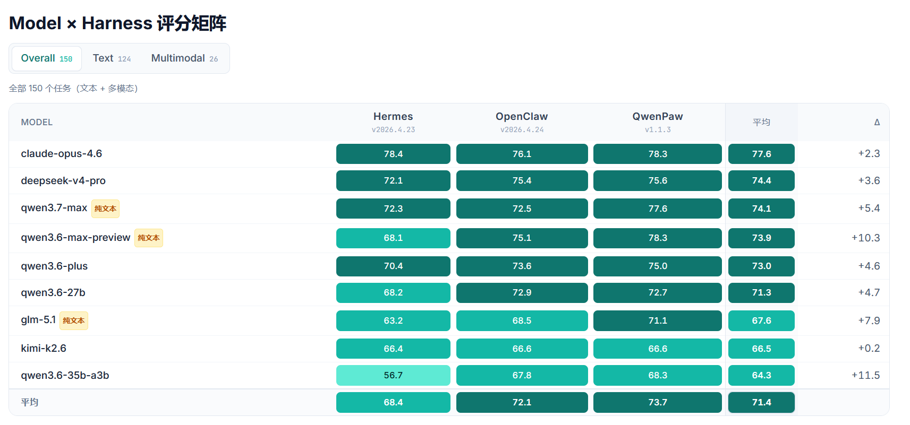

# Agent评测_v4

- Source: `Agent评测_v4.pptx`
- Total slides: 11

## Slide 1

基于 PawBench 的 Agent 评测

三维交叉评测

Model · 决定能力上限

Agent 表现 = f(Model, Harness)

Harness · 决定稳定落地

Model × Harness × Task 三维交叉评测体系

Task · 决定任务场景

150 道标准化任务 · 自动评分引擎 · Docker 内网隔离 · 七维原子能力诊断

三者独立评测，定位真实瓶颈

## Slide 2

02 / 11

为什么需要 Agent 评测

两大核心痛点驱动 Agent 评测需求，PawBench 提供标准化解法

升级效果无法量化

→ PawBench 解法

模型 / Agent 升级后效果好坏，依赖人工挑选少量案例来判定

150 道标准化任务 + 自动评分引擎

缺乏客观数据支撑，无法形成可靠的技术决策依据

跑完即出分，版本间可横向对比，数据说话

现有方案局限

→ PawBench 解法

通用 LLM 榜单不评估工具调用与 Agent 行为

开源 + Docker 沙箱隔离，完全私有化部署

学术 Benchmark 依赖公网服务，无法满足内网部署要求

数据不出网，安全可控，零外部依赖

需要一个标准化、可复现、内网可用的 Agent 评测方案

PawBench 带来的价值

量化升级效果

精准定位短板

内网安全运行

每次 Agent / LLM 升级后跑一遍，数据说话

切片分析可定位具体能力和场景的退化

Docker 隔离，任务数据可改造为离线

## Slide 3

03 / 11

主流 Agent 评测方案对比

工具

定位

评测对象

关键维度评分

优势

劣势

最佳场景

完整Agent ★★★★★

Task/Judge/Runner 解耦，支持多 Agent

内网部署 ★★★★★

PawBench

Agent 评测平台

Model + Harness + Task

社区规模发展中

企业Agent评测

扩展能力 ★★★★★

框架接入；Model×Harness 交叉评测

资料生态 ★★★★

完整Agent ★★★★★

真实 Linux 桌面交互，覆盖 200+

内网部署 ★★★★

WildClawBench

Agent 交互评测

Agent System

环境依赖重，内网部署门槛高

桌面Agent研究

扩展能力 ★★★★

软件品类；环境复杂度高

资料生态 ★★★

完整Agent ★★★

专注 Skill 能力评测，任务设计

内网部署 ★★★★

SkillsBench

Skill 评测

Agent Skill

不测完整 Agent 流程

Skill 评估

扩展能力 ★★★

精巧；适合验证单一 Skill 效果

资料生态 ★★★

完整Agent ★★★★

覆盖多模态 Agent 场景

内网部署 ★★★

PinchBench

多模态Agent评测

Agent+Multimodal

任务规模较小

多模态Agent

扩展能力 ★★★

任务含公网依赖

资料生态 ★★

完整Agent ★★★★★

学术影响力大，8 大类环境覆盖

内网部署 ★★★

AgentBench

Agent Benchmark

Agent System

部分环境依赖公网 API

学术研究

扩展能力 ★★★★

广；部分环境依赖公网 API

资料生态 ★★★★★

完整Agent ★★★

Meta 出品，概念验证式任务

内网部署 ★★

GAIA

通用AI评测

LLM + Agent

依赖公网，不能内网部署

通用Agent评测

扩展能力 ★★

设计；公开 Leaderboard

资料生态 ★★★★

完整Agent ★★

Coding Agent 事实标准

内网部署 ★★★★

SWE-bench

代码修复评测

Coding Agent

只覆盖代码修复场景

代码Agent

扩展能力 ★★

社区活跃度最高

资料生态 ★★★★★

完整Agent ★★★

框架成熟，CI 集成完善

内网部署 ★★★★★

DeepEval

评测框架

LLM / RAG / Agent

不提供 Agent 任务体系

企业质量回归

扩展能力 ★★★★★

企业使用广泛

资料生态 ★★★★★

完整Agent ★★

轻量成熟，Prompt/模型 A/B 测试

内网部署 ★★★★★

Promptfoo

Prompt 评测

Prompt + Model

不适合作 Agent 评测

Prompt 调优

扩展能力 ★★★★★

快速迭代友好

资料生态 ★★★★★

评分说明：

★★★★★ 优

★★★★ 良

★★ 弱

| 内网部署 = 内网可运行 + 公网依赖度的综合评价

数据来源：各项目公开文档及 GitHub 仓库，截至 2025 年 7 月。PawBench 底层复用 OpenJudge 评测引擎。

## Slide 4

04 / 11

PawBench 的 优势

综合 9 个主流方案对比 + 企业级 Agent 评测落地需求

完整 Agent 评测

内网安全运行

1

2

同时评估 Model × Harness × Task

Docker 沙箱隔离，数据不出网

核心优势

核心优势

非纯 LLM 榜单（不测工具调用）

区别于 GAIA / AgentBench / PinchBench

差异化

差异化

非纯 Skill 评测（不测完整流程）

等依赖公网 API 的方案

Model × Harness 交叉评测

开源可扩展

3

4

行业首创 Model × Harness 解耦设计

Task / Judge / Runner 完全解耦

核心优势

核心优势

独立衡量模型能力与工程稳定性

基于 OpenJudge 生态，Apache 2.0 协议

差异化

差异化

定位真实瓶颈来源

阿里通义实验室AgentScope团队维护

唯一在「完整 Agent」「内网部署」「可扩展」三项同时 ★★★★★ 的方案

## Slide 5

05 / 11

PawBench能力与评测设计

核心设计理念

三步评测流程

Agent 表现 = f(Model, Harness)

1

2

3

选择模型与

Docker 沙箱

自动 + LLM

Model 决定能力上限 · Harness 决定稳定落地 · 两者独立评测才能发现真实瓶颈

Harness 组合

隔离运行

双重评分

七种能力诊断

平台设计要点

评测策略

Tool_Use

工具调用与编排

Model × Harness × Task 三维交叉设计，独立衡量每个因素贡献

Skill_Use

Skill 发现与执行

每任务独立 Docker 容器，严格超时与重试，确保可复现

评分模式

Code_Manipulation

代码操作与修复

automated（确定性断言检查）· llm_judge（语义评估）· hybrid（混合）

Logic_Reasoning

逻辑推理

覆盖场景

Planning

多步任务规划

办公协同 · 软件工程 · 数据分析 · 信息检索 · 自动化脚本

Math_Computation

数学计算

任务复杂度

Self_Verification

自我验证与纠错

L1（1-2步）· L2（3-5步）· L3（5+步含条件分支）— 适配不同评测需求

当前已评测 9 个模型 × 3 个 Harness × 150 道任务 = 4,050 个评测单元

## Slide 6

06 / 11

PawBench 官方评测结果 · Model × Harness 评分矩阵

全景 150 个任务（文本 + 多模态） · 9 模型 × 3 Harness · Overall 综合得分

数据来源：PawBench OpenJudge 评测引擎 · 截至 2025 年 7 月 · 平均分 = 跨 harness 加权 · 单元格颜色深浅代表分数高低

## Slide 7

07 / 11

PawBench评测任务体系

150 道任务 × 6 个源数据集 × 五维标签体系，支持精细化评测分析

任务来源

五维标签体系

来源

数量

主要覆盖领域

应用场景 scenario

自建任务

21

Office / Software_Engineering / Data_Analysis

自动化、信息检索、安全对齐

Information_Retrieval / Automation

claweval

52

办公协同、数据分析、内容创作

能力 capabilities

qwenclawbench

29

自动化、软件工程、安全对齐

Logic / Math / Code / Tool / Skill / Plan / Verify

复杂度 complexity

pinchbench

23

办公流程、软件工程、信息检索

L1（1-2步） / L2（3-5步） / L3（5+含分支）

skillsbench

15

长程 Skill、领域自动化

输入模态 modality

wildclawbench

10

办公流程、安全对齐

text / multimodal（image, audio, video）

运行环境 environment

closed（离线复现） / open（需联公网）

五维标签如何赋能评测

按场景分类对比

按能力定向诊断

按复杂度分层评估

只在办公协同场景下对比模型表现，

单独筛选 Tool_Use 或 Planning 任务，

对比 L1/L2/L3 不同复杂度下的表现差异，

排除其他场景噪声，结论更聚焦

精准定位模型在特定能力上的短板

识别模型在多步推理中的退化点

每道任务 5 维标签可任意组合筛选，灵活构建定制化的评测维度和对比视图

## Slide 8

08 / 11

任务执行与评分实战 · 以 T053 为例

借 T053 看清 PawBench「执行 → 采集 → 评分 → 汇总」的评测链路——它同样适用于其它日常任务（下页对照）

任务 T053 ｜ 来源 pinchbench ｜ 类型 内容创作·写作 ｜ 复杂度 L1 ｜ 环境 closed ｜ 评分 hybrid（自动 0.6 + LLM 0.4）

指令：撰写一篇约 500 词《远程办公对软件开发者的好处》博客，并保存为 blog_post.md （纯文本、无外部依赖）

① 沙箱执行

② 结果采集

③ 双重评分 · hybrid

④ 汇总得分

- Agent 在 Docker 容器中隔离运行，独立执行任务
- · 纯文本创作，无需联网
- · 无外部依赖 / 无预置文件
- · environment = closed（可离线复现）
- · 超时 300s 内产出 blog_post.md

- harness 采集运行产物与过程：
- · OpenClaw session → 归一化为 transcript 事件流
- (message / toolCall / toolResult)
- · 新生成文件内容注入 transcript
- · 产物落盘 workspace_path
- 评分只读这两个输入，对框架中立

- 自动检查 权重 0.6
- · 文件 blog_post.md 是否存在
- · 词数 450–550 → 1.0（区间打分）
- · 标题 + 段落结构（≥3 段）
- · remote / developer 关键词命中
- LLM 评判 权重 0.4
- · 质量30 · 结构25 · 写作20
- · 词数15 · 完成度10（Rubric）

- 最终得分
- score = 0.6 × 自动分
- + 0.4 × LLM 分
- 混合惩罚机制
- · 自动分 < 0.75 时
- → LLM 分被置 0
- · 防止跳过任务 / 空文件刷分
- (API 真实失败时豁免)

▶

▶

▶

一张任务卡 = Prompt + Expected Behavior + 自动检查(代码) + LLM评分细则 ｜ 评分仅依赖 transcript 与 workspace_path，对 Agent 框架保持中立

## Slide 9

09 / 11

PawBench 任务 ↔ 日常工作能力

日常 7 类使用场景中，6 类在 PawBench 都有强匹配任务；与T053 走完全相同的「执行→采集→评分→汇总」链路

| 日常能力 | 对应任务 | 评分方式 | 考察核心 |
| --- | --- | --- | --- |
| 邮件处理 | T016 Email Triage | hybrid（自动 0.35 / LLM 0.65） | 读收件箱 → 分类(需回复/通知/垃圾) → 结构化输出 |
| 通讯录 / CRM | T026 / T027 CRM Export | hybrid（自动 0.5 / LLM 0.5） | 从 CRM 导出客户与通讯录数据，并做错误恢复 |
| 内部新闻 / 资讯 | T025 Newsletter Curation | hybrid（自动 0.4 / LLM 0.6） | 多源 RSS 筛选 → 编辑摘要 → 形成技术简报 |
| Excel / 表格 | T140 Xlsx Recover Data | hybrid（自动 0.6 / LLM 0.4） | 读 nasa_budget_incomplete.xlsx → 修复 15 个 ??? 缺值（跨 4 工作表依赖）→ 存 nasa_budget_recovered.xlsx |
| 文档 (PDF) | T055 合同分析 / T058 论文通俗摘要 | llm_judge（纯 LLM 评判） | 读 PDF 合同 → 法律条款与风险评估 → .md；读论文 PDF → 通俗摘要 → .txt |
| 代码处理 | T064 Playwright E2E | hybrid（自动 0.5 / LLM 0.5） | 编写并调试端到端表单测试代码（真实代码操作） |
| Skill 创建 | T076 / T078 / T085 / T094 | hybrid（自动 0.4 / LLM 0.6） | 编写可复用 SKILL.md（frontmatter+方法）→ 用该 skill 完成实际任务 |
| Skill 使用 | SkillsBench T126–T140（15） | hybrid（自动/LLM 按任务） | 读 skills/<name>/SKILL.md → 调用其脚本完成专业任务（3D/规划/控制/Excel…） |

注：上述任务均为 hybrid 评分（自动检查 + LLM 评判），与日常使用 OpenClaw 处理邮件 / 表格 / 文档 / 代码 / Skill的能力高度对应。

## Slide 10

10 / 11

PawBench应用场景与集成方式

典型应用场景

集成方式

模型升级评估

环境部署

固定 Harness，横向跑新旧模型，看整体分和切片分变化

Docker 一键部署，拉取 PawBench 仓库，配置模型 API 密钥

完成后即可跑通全量 150 道标准化任务，获得基线评测结果

Agent 框架迭代

固定模型，横向跑不同版本 Harness，验证改动未引入退化

内网适配

自定义 Skill 验证

含公网依赖的任务改造为离线可运行，自定义业务相关任务

新增业务 Skill 后，在相关切片上验证发现和执行效果

支持基于 OpenJudge 自定义 Task / Judge / Runner，灵活扩展

回归测试流水线

持续迭代

集成到 CI 流程，每次 Agent / 模型发布自动触发评测

嵌入 Agent 开发迭代流程，每次发布自动评测

利用五维标签切片分析，精准定位能力变化，推动持续改进

企业需求与能力适配

需求

PawBench 能力

内网私有化部署

✓ 开源 + Docker，数据不出内网

技术特点

评测完整 Agent 系统

✓ Model × Harness × Task 全覆盖

支持 OpenAI 兼容 API 和私有化模型接入，纯 Python 实现，无专有依赖

自定义任务扩展

✓ OpenJudge 生态，灵活可扩展

Task / Judge / Runner 解耦设计，各组件可独立定制和替换

Skill 能力评估

✓ 7 大原子能力含 Skill_Use，15 道专项任务

量化回归

✓ 标准化任务 + 自动评分，CI 可集成

## Slide 11

总结

01

02

03

交叉评测矩阵

灵活可扩展

内网安全就绪

同时评估 Model、Harness 和

Task、Judge、Runner 完全解耦

Docker 沙箱隔离运行

Task 三个维度，回答的不只是

可自定义评测任务和评分规则

完全私有化部署，数据不出网

"模型好不好"，更是"部署后

五维标签体系支持精细化

可集成 CI/CD，自动回归测试

的 Agent 好不好用"

切片分析，定位薄弱环节

支持 OpenAI 兼容 API

9 模型 × 3 Harness × 150 任务

阿里通义实验室

Python 3.11+ / Docker / Node.js

= 4,050 评测单元

AgentScope 团队出品

Apache 2.0 开源协议

Agent 评测正处于关键转折期

从手工挑选个别案例做主观判断，转向标准化、自动化、多维度的量化评测，是 Agent 从实验走向生产的前提。

一个完整的评测体系需要同时覆盖模型能力、任务框架和运行环境三个独立变量，才能真正回答"我的 Agent 到底好不好用"。

开源、可扩展、内网安全的评测基础设施，是推动 Agent 工程化的关键一环。

11 / 11
